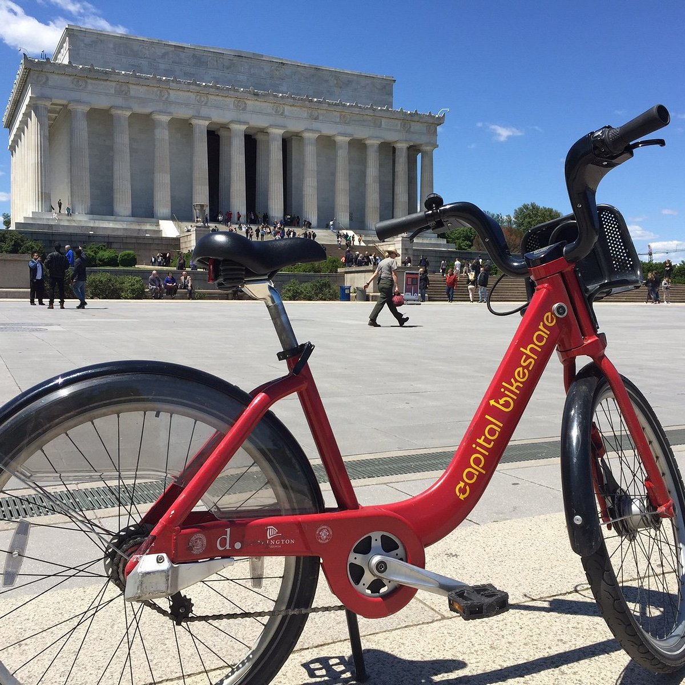
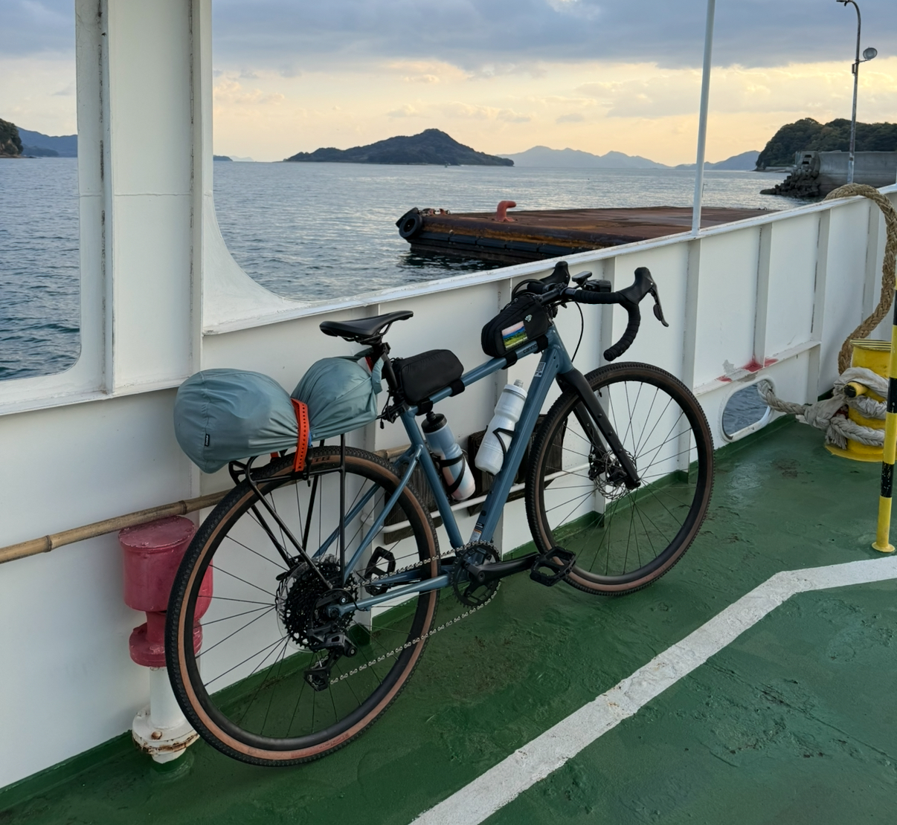

# chain derailment

My current bike, a five month old Cannondale Topstone 3 I named Inspector Clouseau, is the unfortunate corpus to a microSHIFT Sword gravel groupset with a 1x10 drivetrain. A 1x10 drivetrain is not inherently bad; in theory, it's simple to maintain because there's less moving parts, and 10 speed gear is enough for flat, moderate biking, which is mostly what exists in the D.C. area. I really loved it for the first 300-400 miles I rode it, which makes sense given my past bike experience was on the 3-speed (if I was lucky), 40 pound classic bicycles of Washington D.C.'s Capital Bikeshare program. Anything feels lightweight and efficient compared to those beasts. A microSHIFT Sword groupset isn't inherently bad either; although it supposedly costs less than half to manufacture than its brand-name equivalents, this groupset is considered higher end for low-cost drivetrains and is lauded for ["Good lever ergonomics; Shimano-style crank fitting; uses standard Shimano HG freehub body; well-considered cassette ratios; no-fuss shifting"](https://www.bikeradar.com/reviews/components/groupsets/gravel-groupset/microshift-sword-1x-groupset-review).

<figure>

  
  

<figcaption>My bike compared to Cabi. Obviously, my bike is multiple orders of magnitude better, which is why it's on a boat in Japan in this picture.</figcaption>
</figure>

However, the reality of my setup caught up to me on a recent route, the Biwaichi. I chose this route because it is relatively flat with the exception of a few short-distance 7-8% grades. There aren't really 7-8% grades on my go-to routes in the D.C. metro area, and to my dismay, my bike is just not built for it. I had to re-chain manually when the chain derailed on the steeper inclines and the sounds my bike was making were not reassuring.

I should've noticed that the review I referenced for microSHIFT components uses the word "quirk" four times. One of the quirks the reviewer mentions is the drop back into a higher gear if you try to shift 4 cogs at a time, which I ran into but just with downshifting 2 gears at a time, and which the manufacturer responded to with “every shift has a little bit of overshift, which means the cable pulls the derailleur past the index point, helping the shifting to move faster." I think my derailleur must've been misaligned, despite me taking it for an alignment about a week prior to this trip, which only made things worse.
