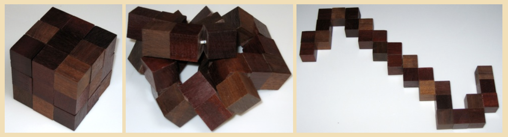

# serpents & serpent cubes

Well within Senate ethics gifting limits of <$50 per individual, a tech company was giving away these quirky little wooden cubes at an event.

I have always loved three dimensional puzzles. Testing my spatial reasoning abilities was always a trip, and testing the spatial reasoning abilities of others was one of my favorite and likely most annoying hobbies. I'd bring little metal puzzles to school, ones that were seemingly simple and sometimes composed of just two parts,
