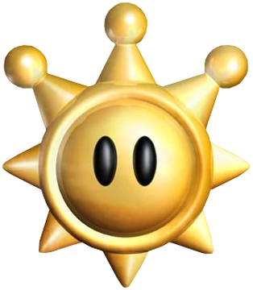
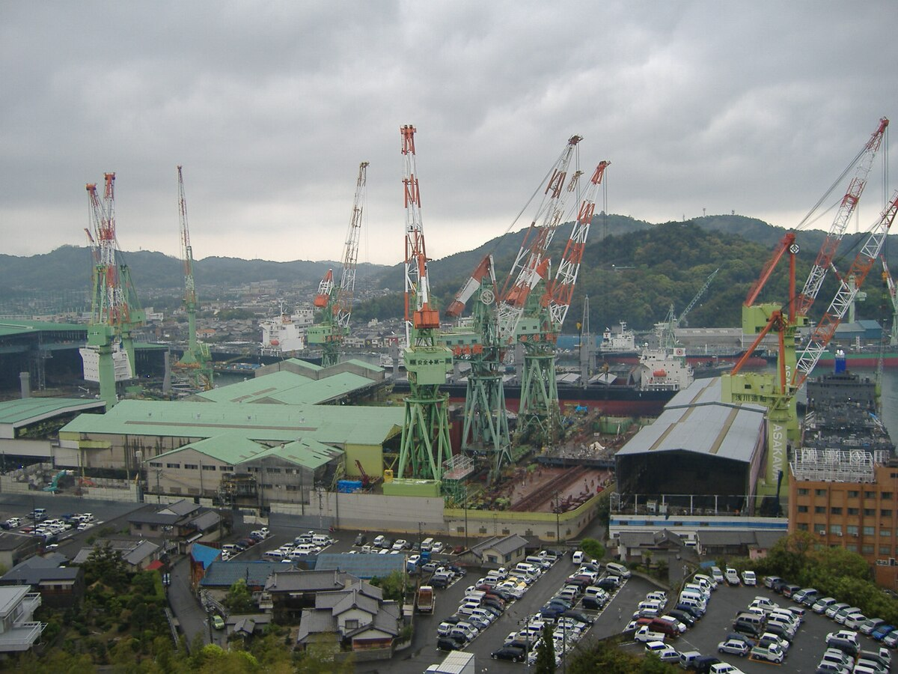
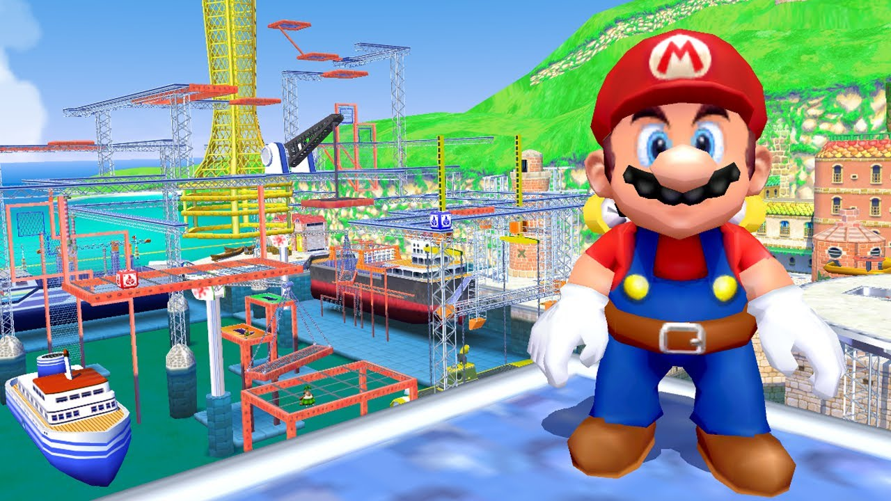

# super mario sunshine & the seto inland sea

In 2006, a weird kid with a poor attention span and a natural inclination towards high-contrast, HDR-ed to shit visuals would discover the Nintendo Gamecube. That kid is now an adult, and believes strongly that Super Mario Sunshine is, without a doubt, the greatest game to ever exist. There are many reasons for this judgment, but I suspect a large part of my affinity for this game has to do with the animation of inanimate objects. Portal, another great game, has GLaDOS. Super Mario Sunshine has Shine Sprites and Piantas and the Flash Liquidizer Ultra Dousing Device (F.L.U.D.D.).

  
  
  

<figure>
<figcaption>Avengers assemble or something like that.</figcaption>
</figure>

Nintendo's storytelling capabilities aside, the gameplay is amazing and especially for its time, the designers did a really good job. There were large amounts of water, and water is notoriously difficult to portray in any visual medium. Just ask the Pixar folks who worked on The Good Dinosaur and [used over 17 terabytes for animating one water sequence](https://www.slashfilm.com/540349/making-of-the-good-dinosaur/) - that's bigger than the entirety of Cars 2 - or any of the numerous researchers and artists tasked with [making the water in Finding Nemo](https://www.awn.com/animationworld/finding-right-cg-water-and-fish-nemo). The Super Mario Sunshine team was limited to a fixed-function CPU in 2001 and really creatively designed their water effects to work within their constraints. They succeeded so well that their water designs were used in Nintendo game design [for over a decade afterwards](https://blog.mecheye.net/2018/03/deconstructing-the-water-effect-in-super-mario-sunshine/).

When I planned my bike trip to Japan, I was not thinking about Super Mario Sunshine at all, or at least not any more than I usually do. I was thinking about 1) planning a trip that was at least as good and ideally better than the [GAPCO route](https://www.crossroadsbiketours.com/GAP-CO-Trails) I was originally planning to that month and 2) choosing a route that would not kill the poor souls I had roped into going on the trip with me. This meant limiting distance to around 50 miles per day, choosing flat routes, and optimizing for scenery and tourist value over normal bicycling payoff, like calories burned (means I get to eat more [pancake](https://soranews24.com/2025/01/27/7-eleven-pancakes-become-a-hit-with-american-tourists-in-japan/)). Ultimately, I ended up selecting three main routes: the [Biwa-ichi](https://en.biwako1.jp/), the [Shiomachi Kaido](https://papersky.jp/en/re-light-and-local-rides-shiomachi-kaido/), and the [Shimanami Kaido](https://www.japan-guide.com/e/e3478.html).

The Shimanami Kaido, the last of the routes we embarked on, crosses through the Hiroshima and Ehime prefectures. From the eighth until about the 12th century, the Ehime prefecture, then known as the Iyo Province, was inhabited by sailors and fishermen that defended Japan against pirates and Mongolian invasions. Even though the 8th century was 13 centuries ago, these roots have persisted through the modern day. Crossing through the Seto Inland Sea, the local towns were full of infrastructure that I suppose was meant for shipbuilding and marine engineering. One of the towns we biked through, Imabari, had a whole company with a strong presence called Imabari shipbuilding:

<figure>
  
  <figcaption>An Imabari Shipbuilding industrial port</figcaption>
</figure>

This company actually [specializes in anti-pirate shipbuilding design](https://gcaptain.com/superstructure-design-promises/), an echo of the area's ancestral roots, but all I could really think about while biking through this place was Ricco Harbor.

<figure>
  
  <figcaption>Mario proudly standing in front of Ricco Harbor.</figcaption>
</figure>

You can unlock Ricco Harbor pretty early on in the game, and the levels aren't that terrible to beat. The gameplay is fun and relatively relaxed - with the exception of the Blooper Surfing Safaris, which are considerably unpleasant - and that experience was replicated as I biked around the Ehime prefecture.
